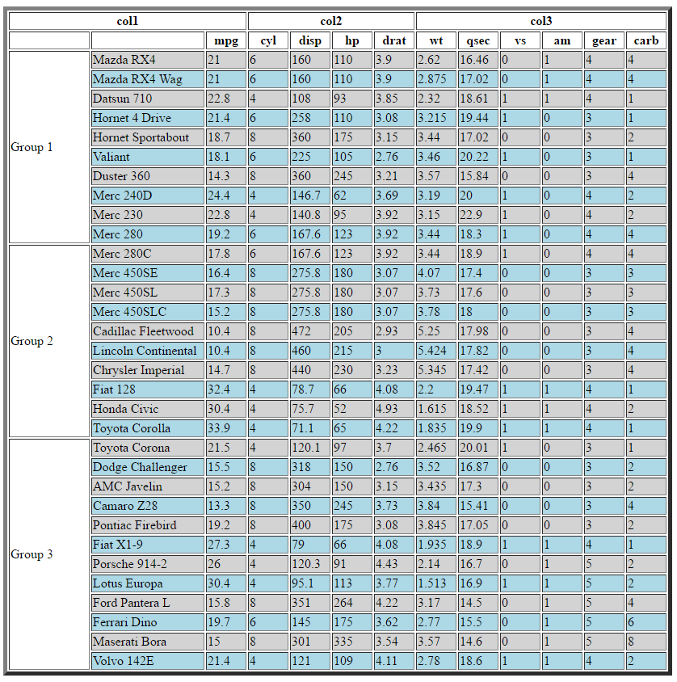

```{r setup, include=FALSE}
knitr::opts_chunk$set(echo = TRUE)
```

The following are a set of more complex examples of the tableHTML package. The goal of these 
examples is to show you what you can do with the package and all the different ways you can use it 
to make the HTML tables they way you want them to look. The point of the examples is to 
demonstrate what can be achieved and not to show nice looking HTML tables (apart from the 
demonstration of the themes).     

### Row groups and Second Headers

```{r example 1}
library(tableHTML)
tableHTML(mtcars, 
          rownames = FALSE, 
          widths = c(120, rep(50, 11)),
          row_groups = list(c(10, 10, 12), c('Group 1', 'Group 2', 'Group 3')),
          second_headers = list(c(3, 4, 5), c('col1', 'col2', 'col3')))
```

### Add row css and column css

```{r example 2}
tableHTML(mtcars, 
          border = 5,
          rownames = TRUE, 
          widths = c(100, 140, rep(50, 11)),
          row_groups = list(c(10, 10, 12), c('Group 1', 'Group 2', 'Group 3')),
          second_headers = list(c(3, 4, 6), c('col1', 'col2', 'col3'))) %>%
 add_css_row(css = list('background-color', 'lightgray'), rows = odd(3:34)) %>%
 add_css_row(css = list('background-color', 'lightblue'), rows = even(3:34)) %>%
 add_css_column(css = list('background-color', 'white'), columns = 'row_groups')
```

### Add row, column, second header and header css

```{r example 3}
tableHTML(mtcars, 
          border = 1,
          rownames = TRUE, 
          widths = c(110, 140, rep(50, 11)),
          row_groups = list(c(10, 10, 12), c('Group 1', 'Group 2', 'Group 3')),
          second_headers = list(c(2, 5, 6), c('', 'col2', 'col3'))) %>%
 add_css_row(css = list('background-color', 'lightgray'), rows = odd(3:34)) %>%
 add_css_row(css = list('background-color', 'lightblue'), rows = even(3:34)) %>%
 add_css_column(css = list('background-color', 'white'), columns = 'row_groups') %>%
 add_css_second_header(css = list(c('border-top', 'border-left'), c('1px solid white', '1px solid white')), 
                       second_headers = 1) %>%
 add_css_header(css = list(c('border-top', 'border-left', 'border-right'), 
                           c('1px solid white', '1px solid white', '1px solid white')), 
                           headers = 1) %>%
 add_css_header(css = list('background-color', 'lightgreen'), headers = 3:13)
```

### scientific theme

```{r example 4}
tableHTML(mtcars, 
          border = 1,
          rownames = TRUE, 
          widths = c(110, 140, rep(50, 11)),
          row_groups = list(c(10, 10, 12), c('Group 1', 'Group 2', 'Group 3')),
          second_headers = list(c(2, 5, 6), c('col1', '', 'col3')),
          theme = 'scientific')
```

### rshiny-blue theme

```{r example 5}
tableHTML(mtcars, 
          border = 1,
          rownames = TRUE, 
          widths = c(110, 140, rep(50, 11)),
          row_groups = list(c(10, 10, 12), c('Group 1', 'Group 2', 'Group 3')),
          second_headers = list(c(2, 5, 6), c('', 'col2', 'col3')),
          theme = 'rshiny-blue')
```

### Colouring a Row Group

```{r example 6}
tableHTML(mtcars, 
          border = 5,
          rownames = TRUE, 
          widths = c(100, 140, rep(50, 11)),
          row_groups = list(c(10, 10, 12), c('Group 1', 'Group 2', 'Group 3')),
          second_headers = list(c(3, 4, 6), c('col1', 'col2', 'col3'))) %>%
 add_css_row(css = list('background-color', 'lightgray'), rows = odd(3:34)) %>%
 add_css_row(css = list('background-color', 'lightblue'), rows = even(3:34)) %>%
 add_css_column(css = list('background-color', 'white'), columns = 'row_groups') %>%
 replace_html(pattern = '<td id="tableHTML_row_groups" style="background-color:white;" rowspan="10">Group 1',
              replacement = '<td id="tableHTML_row_groups" style="background-color:lightyellow;" rowspan="10">Group 1')
```

### Collapsed table

```{r example 7, eval = FALSE}
tableHTML(mtcars, 
          border = 5,
          rownames = TRUE, 
          collapse = 'separate',
          widths = c(100, 140, rep(50, 11)),
          row_groups = list(c(10, 10, 12), c('Group 1', 'Group 2', 'Group 3')),
          second_headers = list(c(3, 4, 6), c('col1', 'col2', 'col3'))) %>%
 add_css_row(css = list('background-color', 'lightgray'), rows = odd(3:34)) %>%
 add_css_row(css = list('background-color', 'lightblue'), rows = even(3:34)) %>%
 add_css_column(css = list('background-color', 'white'), columns = 'row_groups')
```



### Table with Second Headers

```{r example 8}
tableHTML(mtcars, 
          border = 5,
          rownames = TRUE, 
          collapse = 'collapse',
          widths = c(140, rep(50, 11)),
          second_headers = list(c(3, 4, 5), c('col1', 'col2', 'col3'))) %>%
 add_css_row(css = list('background-color', 'lightgray'), rows = odd(3:34)) %>%
 add_css_row(css = list('background-color', 'lightblue'), rows = even(3:34)) %>%
 add_css_thead(css = list('background-color', 'lightblue'))
```

### add_css_column overwrites add_css_row

```{r example 9}
tableHTML(mtcars, 
          border = 5,
          rownames = TRUE, 
          collapse = 'collapse',
          widths = c(140, rep(50, 11)),
          second_headers = list(c(3, 4, 5), c('col1', 'col2', 'col3'))) %>%
 add_css_row(css = list('background-color', 'lightgray'), rows = odd(3:34)) %>%
 add_css_row(css = list('background-color', 'lightblue'), rows = even(3:34)) %>%
 add_css_column(css = list('background-color', 'lightyellow'), columns = 'mpg') %>%
 add_css_thead(css = list('background-color', 'lightblue'))
```

### Table with thead and tbody

```{r example 10}
tableHTML(mtcars, 
          border = 5,
          rownames = TRUE, 
          widths = c(140, rep(50, 11)),
          second_headers = list(c(3, 4, 5), c('col1', 'col2', 'col3'))) %>%
 add_css_thead(css = list('background-color', 'lightgray')) %>%
 add_css_tbody(css = list('background-color', 'lightblue')) 
```

### Column Overwrites Row Overwrites tbody / thead Overwrites table

```{r example 11}
tableHTML(mtcars, 
          rownames = TRUE, 
          widths = c(140, rep(50, 11)),
          second_headers = list(c(3, 4, 5), c('col1', 'col2', 'col3'))) %>%
 add_css_table(css = list('background-color', 'lightgray')) %>%
 add_css_tbody(css = list('background-color', 'lightblue')) %>%
 add_css_row(css = list('background-color', 'red'), row = 5) %>%
 add_css_column(css = list('background-color', 'lightgreen'), columns = 'mpg') 
```

### Table with One Empty Second Header

```{r example 12}
tableHTML(mtcars, 
          border = 5,
          rownames = TRUE, 
          collapse = 'collapse',
          widths = c(140, rep(50, 11)), 
          second_headers = list(c(3, 4, 5), c('col1', '', 'col3'))) %>%
 add_css_row(css = list('background-color', 'lightgray'), rows = odd(3:34)) %>%
 add_css_row(css = list('background-color', 'lightblue'), rows = even(3:34)) %>%
 add_css_thead(css = list('background-color', 'lightblue'))
```

### Table with the Last Second Header Missing

```{r example 13}
tableHTML(mtcars, 
          border = 5,
          rownames = TRUE, 
          collapse = 'collapse',
          widths = c(140, rep(50, 11)), 
          second_headers = list(c(3, 4), c('col1', 'col2'))) %>%
 add_css_row(css = list('background-color', 'lightgray'), rows = odd(3:34)) %>%
 add_css_row(css = list('background-color', 'lightblue'), rows = even(3:34)) %>%
 add_css_thead(css = list('background-color', 'lightblue'))
```

### Only Row Groups no Second Headers

```{r example 14}
tableHTML(mtcars, 
          rownames = TRUE, 
          widths = c(100, 140, rep(50, 11)),
          row_groups = list(c(10, 10, 12), c('Group 1', 'Group 2', 'Group 3'))) %>%
 add_css_row(css = list('background-color', 'lightgray'), rows = odd(2:33)) %>%
 add_css_row(css = list('background-color', 'lightblue'), rows = even(2:33)) %>%
 add_css_row(css = list('background-color', 'lightgreen'), rows = 1) %>%
 add_css_column(css = list('background-color', 'lightyellow'), columns = 'row_groups') 
```

### Using non-collapsed tables in shiny

```{r example 15}
tableHTML(mtcars, collapse = 'separate_shiny', spacing = '5px 2px') %>%
    add_css_table(css = list(c('background-color'), c('lightgray'))) %>% 
    add_css_table(css = list('color', 'blue'))
```

### Using conditional formatting with other tableHTML functions

```{r example_17}
tableHTML(mtcars,
          widths = c(140, rep(50, 11)),
          theme = 'scientific') %>%
  add_css_row(css = list('background-color', '#E0E0E0'), rows = odd(3:34)) %>%
  add_css_conditional_column(conditional = 'between',
                             between = c(3.5, 4.22), 
                             css = list(c('background-color'), c('gray')),
                             columns = c('drat', 'wt')) %>%
  add_css_header(css = list(c('transform', 'height'), 
                            c('rotate(-45deg)', '40px')),
                 headers = 1:12)

```

### Iris dataset with second headers, rowgroups, and conditional css

Note: the `<div>` container is introduced,
because the css property `'transform:rotate(...deg);'` would rotate the whole `<td>` 
element would be rotated and background colour would be out of place

```{r example_16}
tableHTML(iris[c(1:5, 51:55, 101:105), 1:4], 
          rownames = FALSE,
          headers = rep(c('Length', 'Width'), 2),
          second_headers = list(c(1, 2, 2), c('Species', 'Sepal', 'Petal')),
          row_groups = list(rep(5, 3), paste0('<div style="width:100%; height:100%; ',
                                               'transform:rotate(-90deg); font-size:16px; ',
                                               'font-weight:bold; color:white; align:center">', 
                                               c('setosa', 'versicolor', 'virginica'),
                                               '</div>'))) %>%
  add_css_column(css = list(c('background-color', 'border'),
                            c('gray', 'white')), 
                 columns = 'row_groups') %>%
  add_css_second_header(css = list(c('color', 'background-color'),
                                   c('white', 'gray')),
                        second_headers = 1:3) %>%
  add_css_header(css = list(c('color', 'background-color'),
                            c('white', 'gray')),
                 headers = 1:5) %>%
  add_css_conditional_column('colour_rank',
                             colour_rank_theme = 'White-Green',
                             columns = 1:2,
                             same_scale = FALSE) %>%
  add_css_conditional_column('colour_rank',
                               colour_rank_theme = 'White-Blue',
                             columns = 3:4,
                             same_scale = FALSE)
```

\     


