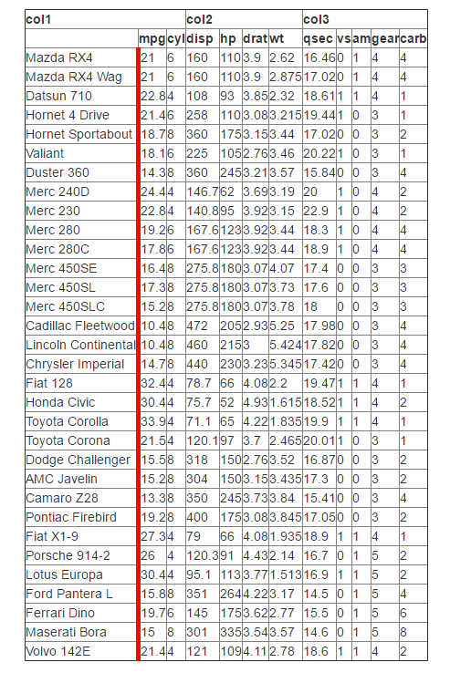
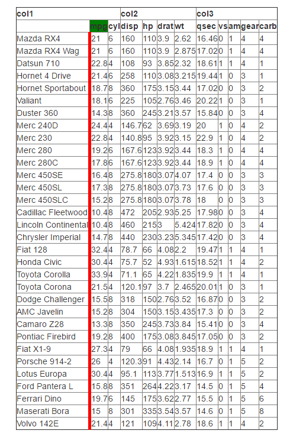

```{r setup, include=FALSE}
knitr::opts_chunk$set(echo = TRUE)
```

This is a package for building CSS-ible HTML tables in an easy way, which are compatible with shiny. 
The main function `tableHTML` will convert a data.frame or matrix or any other object that can be
converted into a data.frame into an HTML table. Using the function on R Studio will print the table
on the viewer otherwise it will use the default browser. The default tables are built without any 
CSS in order to allow for full flexibility although two themes are included.

In order to see the most basic example with tableHTML you could type:

```{r basic}
library(tableHTML)
tableHTML(mtcars)
```

### Removing Row Names

To remove row names from the HTML table you can type:

```{r rownames}
tableHTML(mtcars, rownames = FALSE)
```

### Adding a table class

The class argument sets the class name for the table. The default will be of the form 
table\_dataframeName. For example, for mtcars the HTML table's class would be table\_mtcars.
This makes it easier to add css to it in case there are multiple tables.

```{r, eval = FALSE}
mytable <- tableHTML(mtcars)
str(mytable)
# Classes 'tableHTML', 'html', 'character'  atomic [1:1] 
# <table class=table_mtcars border=1 style="border-collapse: collapse;">
# <tr>
#   <th id=header_1> </th>
#   <th id=header_2>mpg</th>
#   <th id=header_3>cyl</th>
# truncated...
```

And with a custom class:

```{r, eval = FALSE}
mytable <- tableHTML(mtcars, class = 'myClass')
str(mytable)
# Classes 'tableHTML', 'html', 'character'  atomic [1:1] 
# <table class=myClass border=1 style="border-collapse: collapse;">
# <tr>
#   <th id=header_1> </th>
#   <th id=header_2>mpg</th>
#   <th id=header_3>cyl</th>
# truncated...
```


### Adding Second Headers that span multiple columns

In case you would like to add second headers that span multiple columns you can do it by providing a
list in the `second_header` argument. The first element will contain the column spans 
(i.e. a numeric atomic vector) whereas the second element will contain the names 
(i.e. a character atomic vector).

For example:

```{r second header}
library(tableHTML)
tableHTML(mtcars, second_header = list(c(3, 4, 5), c('col1', 'col2', 'col3')))
```

### Adding Row Groups that span multiple rows

In case you would like to add row groups that span multiple rows you can do it by providing a
list in the `row_groups` argument. The first element will contain the row spans 
(i.e. a numeric atomic vector) whereas the second element will contain the names 
(i.e. a character atomic vector).

For example:

```{r row groups}
tableHTML(mtcars, 
          rownames = FALSE, 
          row_groups = list(c(10, 10, 12), c('Group 1', 'Group 2', 'Group 3')))
```

### Change the widths

Obviously, the above tables are far from appealing since they have no css. So we can start styling
them now. A very important feature is to be able to control the column widths. You can do this with
the widths argument. 

The widths argument specifies the columns' width in pixels. It needs to have the same length as the
number of columns (if rownames is TRUE, rownames are also considered a column). 
If second headers exist these will stretch according to their underlying columns' widths. 

As an example:

```{r widths}
tableHTML(mtcars, 
          widths = rep(100, 12), 
          second_header = list(c(3, 4, 5), c('col1', 'col2', 'col3')))
```

### Change the border

By default the table border is set to 1. If you set to 0 it will remove all the lines (the grid) 
completely. Setting it to an integer greater than 1 will increase the size of the table's outside
border.

```{r border}
tableHTML(mtcars, border = 0)
```

### Adding a caption

If you want a caption (title) for your table you can add one with the caption argument.

```{r caption}
tableHTML(mtcars, caption = 'This is  a table')
```


### Adding a footer

If you want a footer for your table you can add one with the footer argument.

```{r footer}
tableHTML(mtcars, footer = 'This is  a footer')
```

### Collapse the table

By default tableHTML collapses the table, so that there is no spacing between cells. You can change
this behaviour by using the collapse argument.

```{r collapse, eval = FALSE}
tableHTML(mtcars, collapse = 'separate')
```


\     

In order to use a non-collapsed table on shiny you need to use the `collapse = 'separate_shiny'`
argument. shiny uses bootstrap 3 by default which uses 
`table {border-collapse: collapse; border-spacing:0;}` in its css. `collapse = 'separate_shiny'`
will use the `!important` keyword in HTML which overwrites the default bootstrap 3 styling. Web
developers argue that using `!important` can be dangerous since it overwrites previously set styles,
so only use it on shiny or other web applications where tables are collapsed by default.

```{r collapse 2}
tableHTML(mtcars, collapse = 'separate_shiny')
```

### Spacing

If collapse is either separate or separate_shiny then you can use the spacing argument to change
the spacing between the cells. This only works if collapse is separate or separate_shiny otherwise
it is not taken into account. You can use one or two length distances. If two length distances are
used, the first specifies the horizontal spacing and the second one the vertical spacing.

```{r spacing 1}
tableHTML(mtcars, collapse = 'separate_shiny', spacing = '2px')
```

\     

```{r spacing 2}
tableHTML(mtcars, collapse = 'separate_shiny', spacing = '5px 2px')
```

### Specifying a theme

Although the package has been designed so that it gives the utmost freedom to the user to style the
HTML table as they please, two themes have been included for those who need something quick and nice.
The package offers two themes for now: scientific and rshiny-blue. Not specifying a theme defaults to
`theme = 'default'` which means a table with no css (so that it can be css-ed later on). For obvious 
reasons widths have not been included in themes so they would need to be added manually from the 
function call.
     
**Notice**: When working with themes you can still add extra css (using the add\_css\_* family from
below) but you will not be able to overwrite the styling that is there e.g. to change the width of
the lines.

```{r theme-scientific}
tableHTML(mtcars, widths = c(140, rep(50, 11)), theme = 'scientific')
```

\     

```{r theme-rshiny-blue}
tableHTML(mtcars, widths = c(140, rep(50, 11)), theme = 'rshiny-blue')
```

------

## add\_css\_* family

These functions add inline CSS to the HTML table. The package has been developed so that the 
functions are chained with the `%>%` (pipe) operator which comes from the `magrittr` package. 
You can chain as many of those as you want
when building your HTML table. The CSS code is added within the HTML table. This is ok for simple
table styling but for more complex CSS styles (like the hover selector) it would still require a
separate css file (we will see how to work with those in shiny later on).

### add\_css\_row

In order to add css to specific table rows you need to use the `add_css_row` function. The function
has three arguments:

1. *tableHTML*: A tableHTML object (created by `tableHTML()`)
2. *css*: A list of two elements with the corresponding css. The first element of the list should 
          be an atomic vector with the style definitions (e.g. background-color). The second element
          will be an atomic vector with the same length as the first element, which will contain the
          style definitions' values (e.g. red).
3. *rows*: A numeric atomic vector with the indices of the rows on which the style definitions 
           will be applied. **headers and second_headers are also part of the rows**. Default is NULL
           which means that it will be applied to all rows.

For example:

```{r add css row 1}
mtcars %>%
  tableHTML(widths = c(140, rep(45, 11))) %>% 
  add_css_row(css = list(c('background-color', 'border'), c('lightblue', '2px solid lightgray')))
```

\    

And adding row indices manually:

```{r add css row 2}
mtcars %>%
  tableHTML(widths = c(140, rep(45, 11))) %>% 
  add_css_row(css = list(c('background-color', 'border'), c('lightblue', '2px solid lightgray')),
              rows = 2:33)
```

\   

It is very common in HTML tables to highlight odd rows with one color and even rows with another.
We can achieve this with the rows argument and the helper funtions from the tableHTML package `odd`
and `even`.

```{r add css row 3}
mtcars %>%
  tableHTML(widths = c(140, rep(45, 11))) %>% 
  add_css_row(css = list('background-color', '#f2f2f2'),
              rows = odd(1:33)) %>%
  add_css_row(css = list('background-color', '#e6f0ff'),
              rows = even(1:33))
```

### add\_css\_column

In order to add css to specific table columns you need to use the `add_css_column` function.
The function will add css to the columns, but not to the headers and second_headers. To add css
to those you would need to use `add_css_header` and `add_css_second_header` respectively. In HTML
terminology `add_css_row` modifies the _td_ tag.
The function has three arguments:

1. *tableHTML*: A tableHTML object (created by `tableHTML()`)
2. *css*: A list of two elements with the corresponding css. The first element of the list should 
          be an atomic vector with the style definitions (e.g. background-color). The second element
          will be an atomic vector with the same length as the first element, which will contain the
          style definitions' values (e.g. red).
3. *column_names*: A character atomic vector with the names of the columns where the style
                   definitions will be applied on. At least one column name must be provided. 
                   If the rownames are included the column name is implied to be "rownames". If
                   row groups are included the column name is implied to be "row_groups" headers.

For example:

```{r add css column 1}
mtcars %>%
  tableHTML(widths = c(140, rep(45, 11))) %>% 
  add_css_column(css = list(c('background-color', 'border'), c('lightblue', '3px solid lightgray')), 
                 column_names = c('cyl', 'hp', 'rownames'))
```

\    

Keep in mind that if you apply the **same** style to both rows and columns, column styles will 
overwrite row styles:

```{r add css column 2}
mtcars %>%
  tableHTML(widths = c(140, rep(45, 11))) %>% 
  add_css_row(css = list('background-color', '#f2f2f2')) %>%
  add_css_column(css = list('background-color', 'lightblue'), 
                 column_names = c('cyl', 'hp', 'rownames')) 
 
```

In general inner tag style definitions will overwrite outer tag style definitions.    

For example:

```{r, eval = FALSE}
mytable <- tableHTML(mtcars)
print(mytable, viewer = FALSE)
<table class=table_mtcars border=1 style="border-collapse: collapse;">
<tr>
  <th id=header_1> </th>
  <th id=header_2>mpg</th>
  <th id=header_3>cyl</th>
</tr> 
truncated...
```

`add_css_row` will add the style definitions in `<tr>` whereas `add_css_header` will add the css
in `<th>`. Since the `<th>` tag is within the `<tr>` tag, the style definitions of `th` will 
overwrite those of `tr`. This is only true for the **same** style definitions i.e. if you specify
a `background-color` for both the first row and the headers.


### add\_css\_header

In order to add css to specific table headers you need to use the `add_css_header` function. 
The function has three arguments:

1. *tableHTML*: A tableHTML object (created by `tableHTML()`)
2. *css*: A list of two elements with the corresponding css. The first element of the list should 
          be an atomic vector with the style definitions (e.g. background-color). The second element
          will be an atomic vector with the same length as the first element, which will contain the
          style definitions' values (e.g. red).
3. *headers*: A numeric atomic vector with the indices of the headers where the style definitions 
              will be applied on. At least one header index must be provided.

For example:

```{r add css header 1}
mtcars %>%
  tableHTML(widths = c(140, rep(45, 11))) %>% 
  add_css_header(css = list('background-color', 'lightgray'), headers = c(1, 4))
```

### add\_css\_second\_header

In order to add css to specific table second headers you need to use the 
`add_css_second_header` function. The function has three arguments:

1. *tableHTML*: A tableHTML object (created by `tableHTML()`)
2. *css*: A list of two elements with the corresponding css. The first element of the list should 
          be an atomic vector with the style definitions (e.g. background-color). The second element
          will be an atomic vector with the same length as the first element, which will contain the
          style definitions' values (e.g. red).
3. *second_headers*: A numeric atomic vector with the indices of the second headers where the 
                     style definitions will be applied on. At least one second header index must 
                     be provided.
For example:

```{r add css second header 1}
mtcars %>%
  tableHTML(widths = c(140, rep(45, 11)), 
            second_header = list(c(3, 4, 5), c('col1', 'col2', 'col3'))) %>% 
  add_css_second_header(css = list(c('background-color', 'border'), 
                                   c('lightgray', '3px solid green')),
                         second_headers = c(1, 3))  
```

### add\_css\_caption

In order to add css to the caption you need to use the 
`add_css_caption` function. The function has two arguments:

1. *tableHTML*: A tableHTML object (created by `tableHTML()`)
2. *css*: A list of two elements with the corresponding css. The first element of the list should 
          be an atomic vector with the style definitions (e.g. background-color). The second element
          will be an atomic vector with the same length as the first element, which will contain the
          style definitions' values (e.g. red).

```{r add css caption}
mtcars %>%
  tableHTML(widths = c(140, rep(45, 11)), 
            caption = 'This is a table') %>% 
  add_css_caption(css = list(c('color', 'font-size', 'text-align'), c('blue', '20px', 'left')))  
```

### add\_css\_footer

In order to add css to the caption you need to use the 
`add_css_caption` function. The function has two arguments:

1. *tableHTML*: A tableHTML object (created by `tableHTML()`)
2. *css*: A list of two elements with the corresponding css. The first element of the list should 
          be an atomic vector with the style definitions (e.g. background-color). The second element
          will be an atomic vector with the same length as the first element, which will contain the
          style definitions' values (e.g. red).

```{r add css footer}
mtcars %>%
  tableHTML(widths = c(140, rep(45, 11)), 
            footer = 'This is a footer') %>% 
  add_css_footer(css = list(c('color', 'font-size', 'text-align'), c('blue', '20px', 'left')))  
```

### add\_css\_thead

In order to add css to both the headers and second headers (if any) you could use the 
`add_css_thead` function. The function has two arguments:

1. *tableHTML*: A tableHTML object (created by `tableHTML()`)
2. *css*: A list of two elements with the corresponding css. The first element of the list should 
          be an atomic vector with the style definitions (e.g. background-color). The second element
          will be an atomic vector with the same length as the first element, which will contain the
          style definitions' values (e.g. red).

```{r add css thead}
mtcars %>%
  tableHTML() %>% 
  add_css_thead(css = list('background-color', 'lightgray')) 
```

### add\_css\_tbody

In order to add css to all the table apart from the headers or second headers you could use the 
`add_css_tbody` function. The function has two arguments:

1. *tableHTML*: A tableHTML object (created by `tableHTML()`)
2. *css*: A list of two elements with the corresponding css. The first element of the list should 
          be an atomic vector with the style definitions (e.g. background-color). The second element
          will be an atomic vector with the same length as the first element, which will contain the
          style definitions' values (e.g. red).

```{r add css tbody}
mtcars %>%
  tableHTML() %>% 
  add_css_tbody(css = list('background-color', 'lightgray')) 
```

\    

**Note**: As mentioned above inner tag styling overwrites the same outer tag styling. In this case
`tr` (add\_css\_row), and `td` (add\_css\_column) styling will overwrite the same styling specified
in `thead` or `tbody`.

To demonstrate this with an example:

```{r thead example 1}
mtcars %>%
  tableHTML() %>% 
  add_css_thead(css = list('background-color', 'lightgray')) %>%
  add_css_row(css = list('background-color', 'blue'), rows = 1)
```

\    

```{r thead example 2}
mtcars %>%
  tableHTML() %>% 
  add_css_tbody(css = list('background-color', 'lightgray')) %>%
  add_css_row(css = list('background-color', 'blue'), rows = c(4, 6))
```

### add\_css\_table

In order to add css to the whole table you need to use the 
`add_css_table` function. The function has two arguments:

1. *tableHTML*: A tableHTML object (created by `tableHTML()`)
2. *css*: A list of two elements with the corresponding css. The first element of the list should 
          be an atomic vector with the style definitions (e.g. background-color). The second element
          will be an atomic vector with the same length as the first element, which will contain the
          style definitions' values (e.g. red).

```{r add css table}
mtcars %>%
  tableHTML() %>% 
  add_css_table(css = list('background-color', 'lightgray')) 
```

\      

`<table>` is the outest tag in an HTML table which means that any **same** style definitions in any
other tags will overwrite the table tag's style definitions in the same way as described in the
above cases.

### All together

An example to put everything in action:

```{r all together}
mtcars %>%
  tableHTML(widths = c(140, rep(45, 11)),
            second_header = list(c(3, 4, 5), c('team1', 'team2', 'team3')),
            caption = 'Table of Cars',
            footer = 'Figure 1. Stats for famous cars') %>% 
  add_css_second_header(css = list(c('height', 'background-color', 'font-size'), 
                                   c('40px', ' #e6e6e6', '30px')),
                        second_headers = 1:3) %>%
  add_css_header(css = list(c('height', 'background-color'), c('30px', ' #e6e6e6')),
                 headers = 1:12) %>%
  add_css_row(css = list('background-color', '#f2f2f2'),
              rows = even(1:34)) %>%
  add_css_row(css = list('background-color', '#e6f0ff'),
              rows = odd(1:34)) %>%
  add_css_column(css = list('text-align', 'center'), 
                 column_names = names(mtcars)) %>%
  add_css_caption(css = list(c('text-align', 'font-size', 'color'), c('center', '20px', 'black'))) %>%
  add_css_footer(css = list(c('text-align', 'color'), c('left', 'black')))
```

### replace_html

This is a function that can help you with very specific tasks that cannot be accompliced with the 
above functions (e.g. adding a css style to a specific cell) or with fixing a potential bug 
that I don't know about (in which case please report it on the 
[issues](https://github.com/LyzandeR/tableHTML/issues)) page. The function has been developed so 
that it works with the chaining paradigm. The function uses `sub` or `gsub` internally in order to
replace an HTML string pattern with another.

```{r replace html}
mtcars %>%
 tableHTML(widths = c(140, rep(45, 11))) %>%
 replace_html(' <td id="mpg">21</td>', '<td id="mpg" style="background-color:lightyellow">21</td>')
```

\     

**Note**: A good way to work with this function is to print the table 
(`print(tableHTML(mtcars), viewer = FALSE)`), see how the part you want to
change is written and change that with the appropriate HTML text.

### Hover and other CSS selectors

These are not supported in inline HTML but they can be added through CSS files. We can see how to 
do this in shiny below. 

## tableHTML and shiny

Now that we know about how to use the function's arguments let's see how we can use tableHTML with 
shiny. The implementation is really simple since internally tableHTML uses `htmltools::HTML` to 
convert the table into an HTML object. Simply using `render_tableHTML` and `tableHTML_output` 
will be enough. In reality these functions are just `renderUI` and `uiOutput` which can also be used
instead, since tableHTML creates HTML code.

Let's see an example

```{r shiny 1, eval = FALSE}
library(shiny)
shinyApp(
 ui = fluidPage(
   fluidRow(
    #leave some spacing
    br(),
    column(width = 1),
    tableHTML_output("mytable"))
 ), 
 server = function(input, output) {
  output$mytable <- render_tableHTML( 
   tableHTML(mtcars)
 )}
)
```

Or with a more complex example:

```{r shiny 2, eval = FALSE}
shinyApp(
 ui = fluidPage(
   fluidRow(
    #leave some spacing
    br(),
    column(width = 1),
    tableHTML_output("mytable"))
 ), 
 server = function(input, output) {
  output$mytable <- render_tableHTML( 
   mtcars %>%
     tableHTML(widths = c(140, rep(45, 11)),
               second_header = list(c(3, 4, 5), c('team1', 'team2', 'team3'))) %>% 
     add_css_second_header(css = list(c('height', 'background-color', 'font-size', 'text-align'), 
                                      c('40px', ' #e6e6e6', '30px', 'center')),
                           second_headers = 1:3) %>%
     add_css_header(css = list(c('height', 'background-color', 'text-align'), 
                               c('30px', ' #e6e6e6', 'center')),
                    headers = 1:12) %>%
     add_css_row(css = list('background-color', '#f2f2f2'),
                 rows = even(1:34)) %>%
     add_css_row(css = list('background-color', '#e6f0ff'),
                 rows = odd(1:34)) %>%
     add_css_column(css = list('text-align', 'center'), 
                    column_names = names(mtcars)) 
 )}
)
```


## shiny and CSS

As we said previously CSS selectors cannot be used within HTML so if you use shiny you would need
to include a separate CSS file. Before we start with shiny and CSS let's see the rules applied by
tableHTML. tableHTML creates ids for columns, headers and second headers and gives the table a 
specific class name as it was mentioned previously.

The rules are like this:

* Table: Will get the class from the class argument in the function. The final class will be of 
  the form table_dataframeName.
* Columns: Will get an id which will be the same as the column name. If there are rownames these 
  will have the rownames id. If there are row groups these will have the row_groups id.
* Headers: Will get an id of the form header\_headerIndex. For example the first header will have 
  the id header\_1, the second header will have header\_2 and so on.
* Second\_Headers: Will get an id of the form overheader\_secondHeaderIndex. For example the first 
                   second\_header will have the id overheader\_1,
                   the second header will have overheader\_2 and so on.

Let's see this in practice. We create a CSS file e.g. mycss.css where we will write our css code. 
Then we load this in R shiny in the following way: In the directory where we saved the ui.R file and
the server.R file we also create a www/ folder where we save our .css file. 
In our case that is named mycss.css. We include this file in R using `includeCSS`:

```{r shiny css, eval = FALSE}
#ui.R
shinyUI(
 fluidPage(
  fluidRow(
   #leave some spacing
   br(),
   column(width = 1),
   #include css file in shiny
   includeCSS('www/mycss.css'),
   tableHTML_output("mytable"))
 )
)

#server.R
shinyServer(
function(input, output) {
   output$mytable <- render_tableHTML( 
    tableHTML(mtcars, second_header = list(c(3, 4, 5), c('col1', 'col2', 'col3')))
   )}
)
```

Note: You can find out more about CSS and shiny [here](http://shiny.rstudio.com/articles/css.html).

You can also check the `make_css` function of the package which helps you create a css file.

In order to add a vertical column line we can use the column ids created by tableHTML. To add a 
vertical red line at mpg column, our css file would look like this:

```{CSS}
#mpg {
	border-left: 5px solid red;
}
``` 

Our HTML table will look like this:



In order to change the background color of one of the headers (e.g. the second) our 
CSS would look like this:

```{CSS 2}
#mpg{
	border-left: 5px solid red;
}

#header_2 {
	background-color: green;
}
``` 




And in order to align the first of the second_headers in the center our css would look like:

```{CSS 3}
#mpg{
	border-left: 5px solid red;
}

#header_2 {
	background-color: green;
}

#overheader_1 {
	text-align: center;
}
``` 


You 've made it to the end of this tutorial on tableHTML! Follow the latest development on the 
development page on [github](https://github.com/LyzandeR/tableHTML)


